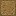

# Masterworks

Another unofficial “Tinker's Construct”-style mod focused on composing items from materials and intermediate parts. Masterworks treats a finished tool as a small tree of components (and those components may themselves be composed), then derives stats and rendering from that structure.

This README explains the core vocabulary (Roles, Properties, Compositions) and where to put the JSON and texture assets that drive the system.

## Contents

- [Concepts](#concepts)
  - [Roles](#roles)
  - [Properties](#properties)
- [Data-Driven Behavior](#data-driven-behavior)
  - [Data Pack Files](#data-pack-files)
    - [Composition](#composition)
    - [Material](#material)
  - [Resource Pack Files](#resource-pack-files)
    - [Shape](#shape)
    - [Palette](#palette)
    - [Tier](#tier)
  - [Data Components](#data-components)
    - [Construct](#construct)
    - [Template](#template)

## Concepts

Masterworks is built on a flexible, data-driven system. Most “content” is expressed as data: which parts are allowed to connect, how stats are computed, and how the final item is rendered. If you understand the concepts in this section, you can author new materials and new craftable compositions without writing code.

### Roles

Roles act as the “type system” for Masterworks constructs. A role describes what something *is allowed to be used as* in a composition. In practice, roles define the valid “slots” that inputs may occupy and the “interfaces” that a composition can fulfill.

When authoring compositions, you define the roles a composition can fulfill in its `roles` block. That block maps the input components to specific sub-roles or textures depending on the role type (e.g., a `materializer` vs a `compositor`). When consuming a composition (crafting/building a construct), those role mappings are what make the visual rendering and system consistent and predictable.

- **Material (`masterworks:material`)**: The fundamental building block (e.g., Iron, Wood). Materials are leaf nodes in a construct tree: they contribute base properties (like durability) and a visual style (palette + color), and they cannot be decomposed further.
- **Component (`masterworks:component/...`)**: An intermediate part of a construct (e.g., `masterworks:component/pickaxe_head`). Components are produced by compositions that consume one or more materials/components as inputs.
- **Item (`masterworks:item`)**: The root role. This represents a complete, usable item stack in the player’s inventory—typically the “final output” role of a composition.

### Properties

Properties define the behavior and stats of a composition. Properties apply to the entire composition natively: the identical formula pipeline calculates the final stats irrespective of which target role is requested.

Currently, properties fall into two categories: numeric expressions (stats) and providers (bridges into vanilla systems). Visual assembly and rendering are driven within the `roles` declarations rather than `properties`.

#### Expression Properties

These are numeric values that can be static (defined directly by a material) or dynamic (calculated by a composition using formulas). Expression properties are the backbone of Masterworks stats: the final value for a tool is derived from the values contributed by its inputs.

- **Examples:** `masterworks:durability`, `masterworks:mining_speed`, `masterworks:attack_damage`.
- **Formulas:** In a composition, you can reference input components by name to calculate the output property.
  - *Example:* `"masterworks:durability": "$head + $handle"`

#### Provider Properties

These are bridge properties that connect Masterworks’ computed values to vanilla Minecraft systems. Provider properties typically don’t represent a “stat” on their own; instead, they define how to *apply* one or more Masterworks properties onto an `ItemStack` in a way vanilla Minecraft understands.

- **Item Attribute Provider:** Maps a Masterworks property to a Minecraft attribute (e.g., applying `masterworks:attack_damage` to Minecraft's `Attributes.AttackDamage`).
- **Tool Rule Provider:** Generates Minecraft tool rules (mining speed and correct tool checks) based on Masterworks properties.
- **Data Component Provider:** A less specialized form attaching any generic data component to the item stack.

## Data-Driven Behavior

### Data Pack Files

Masterworks uses data packs to define compositions and materials. These drive the entire system, allowing for clear extension and customization.

#### Composition

Compositions are rich JSON files defining how constructs can be formed. They act as a bridge, mapping a set of input **components** (named slots with role constraints) to a set of output **roles** (the things the composition can “be”).

Think of a composition as both a recipe and a stat pipeline: it specifies what goes in, handles routing those inputs to specific functions based on the fulfilled role, and specifies global properties (stats, providers) scaling off those inputs.

**Directory:** [src/main/resources/data/masterworks/masterworks/composition/](src/main/resources/data/masterworks/masterworks/composition/)

**Structure:**

- `components`: A list defining the required inputs by their local names (e.g., `"head"`, `"main"`). These names are used in formulas and role definitions.
- `roles`: A map defining the output behavior contexts. Keys are the **Role** this composition can fulfill. Values set the `type` of the role (e.g., `"masterworks:compositor"` or `"masterworks:materializer"`) and map the component names to their specific target roles or expected sub-components.
- `properties`: A map defining the stats and functional behavior of the composition. These apply universally to the composition.

**Key Features:**

- **Formulas:** Property values can be mathematical expressions referencing the input components by their local name (e.g., `$head * 0.5`).
- **Multi-Role:** A single composition can fulfill multiple roles. For example, a "Rod" can exist as a standalone item, but it can also be used as multiple handle-like component roles, each with its own rendering configurations mapped within the `roles` block.

**Example:** [rod.json](src/main/resources/data/masterworks/masterworks/composition/rod.json) takes a single input (`main`). It fulfills roles for three endpoints: `masterworks:item` (to exist as an item), `masterworks:component/pickaxe/handle`, and `masterworks:component/sword/broad/handle`, mapping the main material into each specific sub-component. Its properties are defined globally for the composition.

```json
{
    "components": [
        "main"
    ],
    "roles": {
        "masterworks:item": {
            "type": "masterworks:materializer",
            "main": "masterworks:rod"
        },
        "masterworks:component/pickaxe/handle": {
            "type": "masterworks:materializer",
            "main": "masterworks:pickaxe/handle"
        },
        "masterworks:component/sword/broad/handle": {
            "type": "masterworks:materializer",
            "main": "masterworks:sword/broad/handle"
        }
    },
    "properties": {
        "masterworks:durability": "$main * 0.2",
        "masterworks:mining_speed": "$main",
        "masterworks:attack_speed": "$main"
    }
}
```

**Example:** [pickaxe.json](src/main/resources/data/masterworks/masterworks/composition/pickaxe.json) takes three components as input: a pickaxe head, a binding, and a handle. It outputs properties configured under the `roles` block for the `masterworks:item` role as a "compositor", mapping those components to their final visual targets. The set of blocks it can mine is defined in the `properties` block along with the rest of the calculated stats.

```json
{
    "components": [
        "head",
        "binding",
        "handle"
    ],
    "roles": {
        "masterworks:item": {
            "type": "masterworks:compositor",
            "head": "masterworks:component/pickaxe/head",
            "binding": "masterworks:component/pickaxe/binding",
            "handle": "masterworks:component/pickaxe/handle"
        }
    },
    "properties": {
        "masterworks:durability": "$head + $handle + $binding",
        "masterworks:mining_denied": "$head",
        "masterworks:mining_speed": {
            "block_tag": "minecraft:mineable/pickaxe",
            "value": "$head * 0.4 + $handle * 0.4 + $binding * 0.2"
        },
        "masterworks:attack_damage": "$head",
        "masterworks:attack_speed": "$head * 0.4 + $handle * 0.4 + $binding * 0.2"
    }
}
```

#### Material

Materials are JSON files defining the base properties and visual style of a raw material. They are the primary “source of truth” for raw stats like durability or mining speed, and they define how that material looks when applied to a shape.

**Directory:** [src/main/resources/data/masterworks/masterworks/material/](src/main/resources/data/masterworks/masterworks/material/)

**Structure:**

- `name`: The display name of the material.
- `palette`: Reference to a **Palette** texture used to colorize shapes.
- `color`: The ARGB interface color value of the material (controls text interfaces).
- `properties`: Base stats provided by this material (e.g., durability, mining speed).

**Example:** [diamond.json](src/main/resources/data/masterworks/masterworks/material/diamond.json) defines the properties of diamond, including its palette, interface color, and base stats.

```json
{
    "name": "Diamond",
    "palette": "masterworks:diamond",
    "color": "ff33ebcb",
    "properties": {
        "masterworks:durability": 1561,
        "masterworks:mining_speed": 8.0,
        "masterworks:attack_damage": 7.0,
        ...
    }
}
```

### Resource Pack Files

Texture assets in Masterworks are organized into three categories: shapes, palettes, and tiers. These assets are dynamically combined to render constructs and templates.

#### Shape

Shapes are 16x16 PNGs containing 3-bit-like (8-shade) greyscale masks used to build the final item icon. Masterworks uses these shapes as layers: each layer is colorized by a material palette and then composited together.

**Directory:** [src/main/resources/assets/masterworks/textures/shape/](src/main/resources/assets/masterworks/textures/shape/)


+
 +
  =


#### Palette

Palettes are 8x1 PNGs mapping colors to the shapes’ greyscale indices. When a material is rendered onto a shape, the shape’s pixel intensity selects a color from the palette, producing a consistent “material look” across many shapes.

**Directory:** [src/main/resources/assets/masterworks/textures/palette/](src/main/resources/assets/masterworks/textures/palette/)


#### Tier

Tiers are 16x16 PNGs controlling the background used for rendering template items. They are purely visual and are typically used to distinguish template categories (e.g., basic vs advanced) at a glance.

**Directory:** [src/main/resources/assets/masterworks/textures/tier/](src/main/resources/assets/masterworks/textures/tier/)




### Data Components

These components are attached to `ItemStack`s to store the dynamic data required for Masterworks items.

#### Construct

The Construct data component is attached to a finished construct item (like a pickaxe or sword) to define its structure. It is a recursive data structure that mirrors the hierarchy implied by compositions: each named component is either a material (leaf) or another construct (branch).

**File:** [Construct.java](src/main/java/com/masterworks/masterworks/data/Construct.java)

**Structure:**

- `composition`: The `Composition` this construct implements.
- `components`: A map where keys are the component names defined in the composition, and values are `Component` objects.
  - A `Component` can be either a **Material** (leaf node) or another **Construct** (branch node).

**Example:** A broadsword made of a diamond guard, iron handle, and a dual-material blade (stone and gold).

```json
{
  "composition": "masterworks:sword/broad",
  "components": {
    "guard": {
      "composition": "masterworks:binding",
      "components": { "main": "masterworks:diamond" }
    },
    "handle": {
      "composition": "masterworks:rod",
      "components": { "main": "masterworks:iron" }
    },
    "blade": {
      "composition": "masterworks:sword/broad/blade/dual",
      "components": {
        "left": {
          "composition": "masterworks:sword/broad/blade/edge/straight",
          "components": { "main": "masterworks:stone" }
        },
        "right": {
          "composition": "masterworks:sword/broad/blade/edge/straight",
          "components": { "main": "masterworks:gold" }
        }
      }
    }
  }
}
```

#### Template

The Template data component is attached to a template item (the “blueprint” used in crafting). It defines which compositions can be crafted using this template, and it also provides the visual identity of that template (tier background + icon shape).

**File:** [Template.java](src/main/java/com/masterworks/masterworks/data/Template.java)

**Structure:**

- `tier`: The visual tier of the template (e.g., "basic", "advanced").
- `shape`: The icon to display on the template.
- `compositions`: A list of `Composition` IDs that this template allows the player to craft.

**Example:** An advanced template for crafting broadsword blades. It's capable of crafting both single-material and dual-edged broad blades.

```json
{
  "tier": "masterworks:advanced",
  "shape": "masterworks:sword/broad_blade",
  "compositions": [
    "masterworks:sword/broad/blade",
    "masterworks:sword/broad/blade/dual"
  ]
}
```
